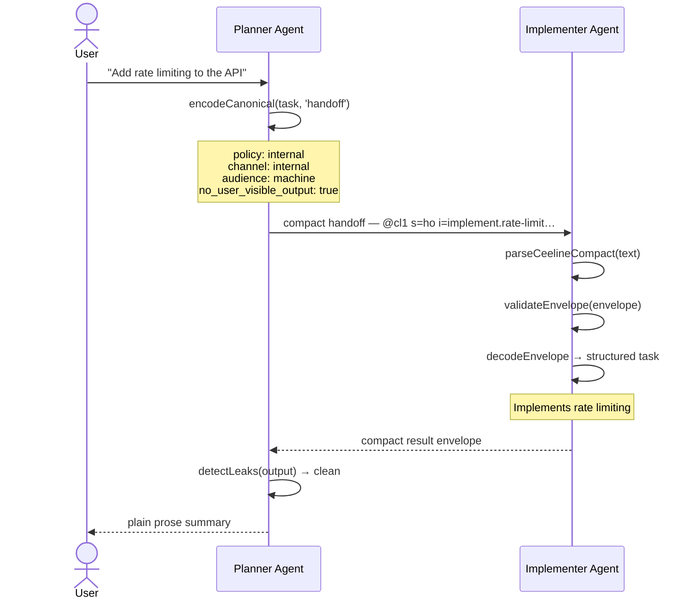
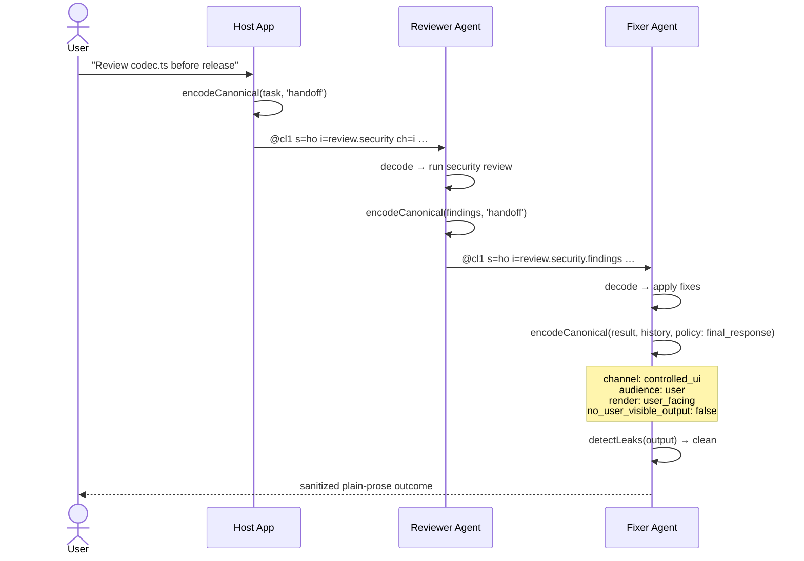
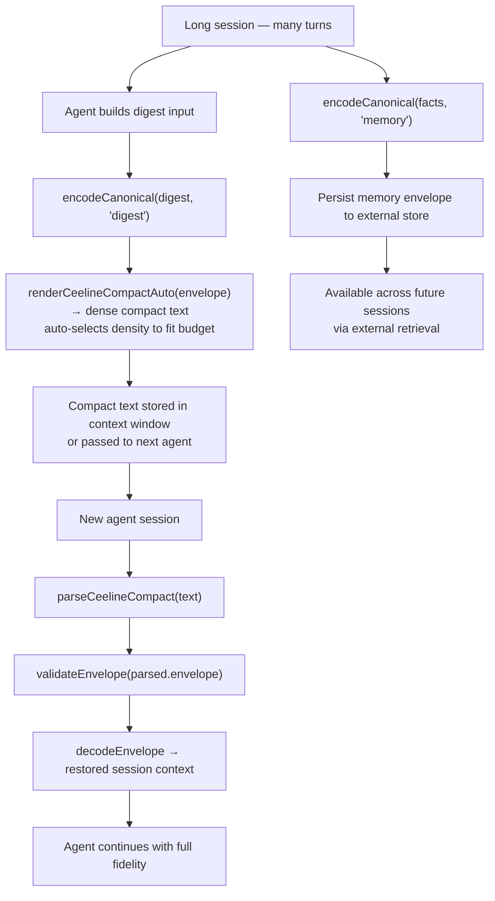

# Ceeline

Schema-first compact transport layer for internal AI communication.

Ceeline reduces token usage on machine-controlled surfaces without changing the
default language of user-facing chat, editors, or documentation. It is a
deterministic translation and validation system for surfaces that a host
application owns end-to-end.

## What it does

- **Compresses** internal-only AI communication (handoffs, summaries, memory
  notes, routing metadata) into a compact wire format
- **Preserves** exact technical tokens — file paths, commands, env vars,
  placeholders, versions, URLs — across every transform
- **Validates** envelopes against typed schemas with deterministic error
  reporting
- **Detects leaks** before compact artifacts reach user-visible output
- **Round-trips** losslessly between JSON envelope and compact text

### Benchmark highlights

| Metric | Value |
|---|---|
| Byte compression | 2.4:1 (58.04% saving) |
| Token compression (cl100k) | 1.97:1 (48.86% saving) |
| Token compression (o200k) | 2.02:1 (50.26% saving) |
| Round-trip fidelity | 100% |
| Integrity trailer overhead | 1.6–3.1% |

Measured across 8 surfaces × 3 densities. Full report in
[benchmarks/report.txt](benchmarks/report.txt).

## Architecture

```
┌──────────────────────────────────────────────────────────────────────────┐
│  Canonical source (human-readable)                                       │
├──────────────────────────────────┬───────────────────────────────────────┤
│  @asafelobotomy/ceeline-schema   │  Envelope + payload JSON schemas      │
│  @asafelobotomy/ceeline-core     │  Encode, validate, render, parse      │
│  @asafelobotomy/ceeline-cli      │  CLI: encode, decode, validate        │
├──────────────────────────────────┼───────────────────────────────────────┤
│  adapters/mcp-server             │  MCP tool surface                     │
├──────────────────────────────────┴───────────────────────────────────────┤
│  Compact transport (#n= integrity trailer)                               │
└──────────────────────────────────────────────────────────────────────────┘
```

## Packages

| Package | Description |
|---|---|
| `@asafelobotomy/ceeline-schema` | TypeScript types, enums, code maps, JSON schemas |
| `@asafelobotomy/ceeline-core` | Validation, compact render/parse, preserve, encode/decode, leak detection |
| `@asafelobotomy/ceeline-cli` | CLI for `encode`, `decode`, `render`, `validate`, `detect-leak` |
| `@asafelobotomy/ceeline-fixtures` | Golden fixtures for all 8 surfaces × 3 compact densities |
| `adapters/mcp-server` | MCP JSON-RPC tool adapter |

## Surfaces

Ceeline v1 supports 8 surfaces for AI-to-AI communication:

| Surface | Code | Use case |
|---|---|---|
| `handoff` | `ho` | Planner-to-implementer, reviewer-to-fixer payloads |
| `digest` | `dg` | Session summaries, heartbeat state, telemetry |
| `memory` | `me` | Internal memory notes, research condensation |
| `reflection` | `rf` | Self-check summaries, post-run audits |
| `tool_summary` | `ts` | Compact tool input/output summaries |
| `routing` | `rt` | Intent classification, scope hints, constraints |
| `prompt_context` | `pc` | Host-owned prompt fragments (machine-private) |
| `history` | `hs` | Participant-local conversation state |

## Compact format

The compact dialect has three density levels:

- **lite** — one key=value per line, human-scannable, omits `tok=` lines
- **full** — semicolon-separated single line, includes `tok=` preserve tokens
- **dense** — like full but drops redundant fields (`cls=`, `ch=`, `md=`, etc.)

Every compact output ends with a `#n=<bytecount>` integrity trailer that the
parser verifies on read.

### Domain stem tables

Ceeline ships four built-in domain stem tables that add specialised
vocabulary for common review and audit contexts. A single header token
activates one or more domains:

| Domain | ID | Stems | Example |
|---|---|---|---|
| Security | `sec` | 24 | `vul`, `xss`, `ath`, `esc`, `sqi` |
| Performance | `perf` | 23 | `lat`, `thr`, `cch`, `p95`, `rps` |
| Architecture | `arch` | 23 | `lay`, `bnd`, `cpl`, `svc`, `api` |
| Testing | `test` | 21 | `cov`, `mck`, `flk`, `e2e`, `snp2` |

Domain stems participate fully in the morphological affix system
(`neg.vul`, `xss.seq`, `re.cch`, etc.).

Example (lite density, handoff surface with security domain):

```
@cl1 s=ho i=review.security ch=i md=ro au=m fb=rj rs=n sz=st mx=500 dom=sec
sum="Review src/core/codec.ts for transport safety before release."
f="Preserve {{PROJECT_ID}} exactly."
ask="Return severity-ordered findings only."
role=rv
tgt=fx
sc=transport,validation
cls=fp
#n=305
```

Full language grammar in [docs/ceeline-language-spec-v1.md](docs/ceeline-language-spec-v1.md).

## Installation

Install from npm — packages are independent; install only what you need.

```bash
# TypeScript / Node.js API
npm install @asafelobotomy/ceeline-core

# Schemas and types only (no encode/decode logic)
npm install @asafelobotomy/ceeline-schema

# CLI (adds `ceeline` binary)
npm install --save-dev @asafelobotomy/ceeline-cli

# MCP server (run as a stdio MCP tool server)
npm install --save-dev @asafelobotomy/ceeline-mcp-server
```

### MCP server setup

Add to your `.mcp.json` (or equivalent agent config):

```json
{
  "servers": {
    "ceeline": {
      "type": "stdio",
      "command": "npx",
      "args": ["-y", "@asafelobotomy/ceeline-mcp-server"]
    }
  }
}
```

This gives your AI agents seven MCP tools: `translate_to_ceeline`,
`translate_from_ceeline`, `validate_ceeline_payload`, `render_verbose_summary`,
`detect_ceeline_leak`, `render_compact`, `parse_compact`.

### Agent plugin drop-in

Copy the `plugin/` directory into your repo root. It ships:

- **Agent definitions** — `ceeline-handoff` and `ceeline-review` ready-to-use agents
- **Skill** — `plugin/skills/ceeline/SKILL.md` loaded by any agent encoding/decoding Ceeline
- **Hooks** — session-start context injection, post-tool auto-validation, pre-render leak guard
- **MCP config** — `plugin/.mcp.json` pre-configured to use `@asafelobotomy/ceeline-mcp-server` via npx

### Host-side compiler prototype

Ceeline can compile host-owned agent/skill/hook files into machine-private
transport envelopes instead of treating those source files as the transport
format themselves.

```bash
npx ceeline compile-host-context plugin
npx ceeline compile-host-context plugin --task "Review Ceeline handoffs for security issues"
npx ceeline compile-host-context plugin --task="Review Ceeline handoffs for security issues"
npx ceeline compile-host-context plugin --compact-only --task "Review Ceeline handoffs for security issues"
```

The prototype scans `.agent.md`, `SKILL.md`, and `hooks.json` files and emits:

- `documents` — extracted intermediate representation (name, tools, sections, route hints, task-match signals)
- `promptContext` — validated `prompt_context` envelopes for rules, workflow, and grounding sections
- `routing` — validated `routing` envelopes for agent/skill selection with stronger task-match signals derived from descriptions, workflow steps, rules, intents, surfaces, and tool lists
- `routingMatches` — scored routing matches for an optional input task string
- `digest` — a run-scoped summary of the compiled bundle
- `history` — a session-scoped compile trace anchor
- `compactBundles` — ready-to-inject compact text bundles for `prompt_context`, `routing`, `digest`, and `history`

This is intended for host-owned prompt assembly. Human-authored source files
remain readable at rest; only their machine-private meaning is compiled into
Ceeline transport.

Use `--json` (default) for structured host integration, including scored
`routingMatches`. Use `--compact-only` to emit only compact bundle text, with
routing bundle ordering biased toward the best task match when `--task` is
provided. The CLI accepts both `--task <text>` and `--task=<text>`.

---

## Quick start

```bash
npm install
npm run build
npm run test
```

### CLI usage

Ceeline encode surfaces support two policy modes:

- `internal` — default; machine-private transport, compact inside the system
- `final_response` — controlled UI boundary; user-facing render defaults

```bash
# Validate an envelope
echo '{"ceeline_version":"1.0",...}' | npx ceeline validate

# Encode canonical input
echo '{"surface":"handoff","intent":"review.security",...}' | npx ceeline encode

# Encode a final user-facing response boundary
echo '{"surface":"history","intent":"ui.final-response","policy":"final_response",...}' | npx ceeline encode

# Detect leaks in text
echo "some output text" | npx ceeline detect-leak
```

### Programmatic usage

```typescript
import { encodeCanonical, validateEnvelope, renderCeelineCompact } from "@asafelobotomy/ceeline-core";

// Encode a handoff envelope
const result = encodeCanonical({
  intent: "review.security",
  source: { kind: "host", name: "myapp", instance: "s1", timestamp: new Date().toISOString() },
  payload: { summary: "Review codec.ts for transport safety" }
}, "handoff");

if (result.ok) {
  // Render to compact format
  const compact = renderCeelineCompact(result.value, "full");
  if (compact.ok) console.log(compact.value);
}

const finalResponse = encodeCanonical({
  intent: "ui.final-response",
  source: { kind: "host", name: "myapp", instance: "s1", timestamp: new Date().toISOString() },
  payload: {
    summary: "The fix has been applied.",
    facts: ["The affected user-facing path is now sanitized."],
    ask: "Share the visible outcome only.",
    span: "exchange",
    turn_count: 1,
    anchor: "assistant-final",
    artifacts: [],
    metadata: {}
  }
}, "history", { policy: "final_response" });
```

Budget-aware rendering:

```typescript
import { renderCeelineCompactAuto } from "@asafelobotomy/ceeline-core";

// Auto-selects density to fit within token budget
const compact = renderCeelineCompactAuto(envelope);
if (compact.ok) console.log(compact.value);
// Returns token_budget_exceeded if no density fits
```

## Core API

| Function | Returns | Purpose |
|---|---|---|
| `encodeCanonical(input, surface, options?)` | `CeelineResult<CeelineEnvelope>` | Build a validated envelope from canonical input using `internal` or `final_response` defaults |
| `validateEnvelope(obj)` | `CeelineResult<CeelineEnvelope>` | Schema-validate an envelope object |
| `parseEnvelope(json)` | `CeelineResult<CeelineEnvelope>` | Parse and validate JSON text |
| `decodeEnvelope(envelope)` | `DecodedEnvelope` | Decode envelope to structured canonical meaning |
| `renderCeelineCompact(envelope, density, options?)` | `CeelineResult<string>` | Render to compact format at specified density |
| `renderCeelineCompactAuto(envelope, options?)` | `CeelineResult<string>` | Auto-select density from token budget |
| `parseCeelineCompact(text)` | `CompactParseResult` | Parse compact text back to structured data |
| `detectLeaks(text)` | `LeakFinding[]` | Scan text for leaked Ceeline artifacts |
| `renderUserFacing(decoded)` | `string` | Clean user-facing rendering after leak checks |
| `activateDomains(ids, morphology)` | `void` | Activate domain stem tables for resolution |
| `resolveAffix(code, morphology)` | `AffixResolution \| null` | Resolve affixed code via morphology engine |
| `extractPreserveTokens(text, classes)` | `string[]` | Extract tokens that must survive transforms |
| `validatePreservation(before, after, set)` | `CeelineResult<true>` | Verify all preserve tokens survived |

All mutating operations return `CeelineResult<T>`, a discriminated union:

```typescript
type CeelineResult<T> = { ok: true; value: T } | { ok: false; issues: ValidationIssue[] };
```

## Usage examples

### Scenario 1 — Agent-to-agent handoff

A planner agent assigns a task to an implementer. The transport is entirely
machine-private. No compact text or envelope JSON ever appears in user-visible
output.



Rules in play:
- Default `policy: "internal"` sets `no_user_visible_output: true` and channel `internal`
- Compact text stays inside the host system at every hop
- `detectLeaks()` runs before any text reaches the user

---

### Scenario 2 — Multi-hop review chain with final-response boundary

A host application runs a three-agent security pipeline. Every internal hop
uses `policy: "internal"`. Only the last step — delivery to the user — uses
`policy: "final_response"`, switching to a `controlled_ui` channel,
`user_facing` render style, and mandatory sanitization.



Rules in play:
- `H → R` and `R → F` use `policy: "internal"` — machine channel, reject fallback
- `F → User` uses `policy: "final_response"` — `controlled_ui` channel, verbose fallback, strict sanitizer
- `pass_through` fallback is forbidden on `controlled_ui` channels; any leak causes a hard reject
- The user never sees compact text, envelope JSON, or routing metadata

---

### Scenario 3 — Session continuity via digest and memory

A long-running session accumulates state. Before context pressure forces
truncation, the current agent compresses session state into a `digest` envelope
and captures key facts in a `memory` envelope. Downstream agents pick up
exactly where processing left off.



Rules in play:
- `renderCeelineCompactAuto` selects `dense` → `full` → `lite` to stay within `max_render_tokens`; returns `token_budget_exceeded` if none fit
- Round-trip fidelity is 100% — file paths, env vars, commands, and placeholders survive byte-for-byte
- `digest` envelope carries window-scoped state; `memory` envelope carries durable facts across session boundaries
- `detectLeaks()` must still pass before any part of either envelope reaches user-facing output

## Testing

```bash
npm run test          # 670 tests via vitest
npm run test:watch    # watch mode
npm run typecheck     # tsc project references
```

670 tests across 17 files covering: validation (all surfaces and source kinds),
compact render/parse for all 8×3 combinations, auto-density selection,
round-trip fidelity, byte-for-byte golden snapshot stability against 24 fixture
files, morphological affix resolution, domain stem table activation and
isolation, symbol expression parsing, dict↔TS sync, robustness probes for
forward compatibility, host compiler (diagnostics, confidence bands, reflection,
tool summary, disk output, learned signal boosts), and CLI integration.

## Benchmarks

```bash
npx tsx benchmarks/run.ts
```

For ad hoc `npx tsx -e` benchmark probes, prefer static imports such as
`import { getEncoding } from "js-tiktoken";`. In this repo, top-level
`await import(...)` fails under `tsx -e` because the eval path is emitted as
CommonJS at the repo root.

Generates `benchmarks/report.json` and `benchmarks/report.txt` with:

- Byte and token compression ratios per surface and density
- Render/parse throughput (envelopes/ms)
- Integrity trailer overhead
- Auto-density selection comparison
- Budget failure detection

## Project structure

```
packages/
  schema/       TypeScript types, enums, JSON schemas
  core/         Encode, validate, render, compact, preserve, leak detection
  cli/          CLI tool + host compiler
  fixtures/     Golden envelope + compact fixtures
adapters/
  mcp-server/   MCP JSON-RPC adapter
plugin/         Reference plugin (agents, skills, hooks) used by host compiler
benchmarks/     Compression and throughput benchmarks
fixtures/       Golden compact text fixtures (8 surfaces × 3 densities)
docs/           Design brief, language spec, ADRs, expansion plans
_shelved/       Paused experimental work (VS Code extension)
```

## Documentation

- [Design brief](docs/ceeline-design-brief-2026-04-11.md) — product spec, surface classes, trust boundaries
- [Compact language spec](docs/ceeline-language-spec-v1.md) — grammar, field codes, trailer, density rules
- [Trust model ADR](docs/adr/0001-trust-model.md)
- [Render policy ADR](docs/adr/0002-render-policy.md)
- [Dialect evolution ADR](docs/adr/0003-dialect-evolution.md)
- [Personal lexicon ADR](docs/adr/0004-personal-lexicon.md)
- [Host compiler expansion plan](docs/host-compiler-expansion-plan-2026-04-13.md) — P0-P9 implementation plan (complete)
- [Remaining steps](docs/ceeline-remaining-steps-2026-04-12.md) — implementation status

## License

[MIT](LICENSE.md) — Copyright © 2026 asafelobotomy
